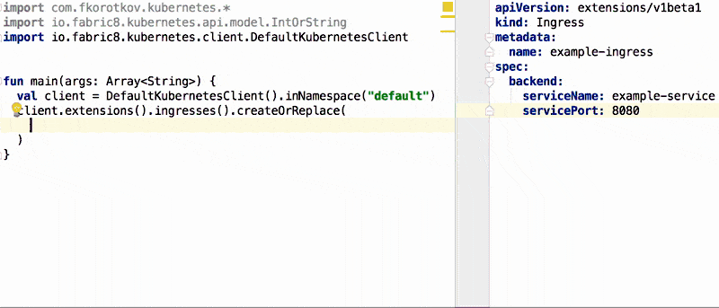

[](https://travis-ci.org/fkorotkov/k8s-kotlin-dsl)
[ ](https://bintray.com/fkorotkov/maven/k8s-kotlin-dsl/_latestVersion)

[Kotlin](https://kotlinlang.org) DSL for [Kubernetes](https://kubernetes.io/) and [Openshift Container Platform](https://www.openshift.com/container-platform/) on top of [fabric8 models](https://github.com/fabric8io/kubernetes-model).



## Usage

`k8s-kotlin-dsl` package can be found on [jcenter](https://bintray.com/bintray/jcenter?filterByPkgName=k8s-kotlin-dsl). Simply add following lines to your `build.gradle`:
 
 ```groovy
repositories {
    jcenter()
} 
 
dependencies {
    compile("com.fkorotkov:kubernetes-dsl:${kubernetes_dsl_version}")
}
```

### Using with `kubernetes-client`

Let's check out how to create an Ingress via [fabric8 client](https://github.com/fabric8io/kubernetes-client). Don't forget to add a dependency on `io.fabric8:kubernetes-client:${kubernetes_client_version}`.

```kotlin
import com.fkorotkov.kubernetes.*
import io.fabric8.kubernetes.api.model.IntOrString
import io.fabric8.kubernetes.client.DefaultKubernetesClient


fun main(args: Array<String>) {
  val client = DefaultKubernetesClient().inNamespace("default")
  client.extensions().ingresses().createOrReplace(
    ingress {
      metadata {
        name = "example-ingress"
      }
      spec {
        backend {
          serviceName = "example-service"
          servicePort = IntOrString(8080)
        }
      }
    }
  )
}
```

### Apply modifications

By leveraging awesomeness of Kotlin it becomes super easy to have a base service template that every microservice is created from:
 
```kotlin
val baseService = defaultServiceTemplate()
baseService.apply {
  metadata {
    name = "foo"
  }
}
```

### Complete Deployment example

Here is an example of `BaseDeployment` that defines a deployment with one replica and mounts a secret that can be used by the service.

```kotlin
class BaseDeployment : Deployment {
  constructor(serviceName: String) {
    metadata {
      name = "$serviceName-service-deployment"
      labels = mapOf(
        "app" to serviceName,
        "tier" to "backend"
      )
    }
    spec {
      replicas = 1
      template {
        metadata {
          labels = mapOf(
            "app" to serviceName,
            "tier" to "backend"
          )
        }
        spec {
          containers = listOf(
            container {
              name  = "$serviceName-service"
              image = "gcr.io/fkorotkov/$serviceName-service:latest"
              volumeMounts = listOf(
                volumeMount {
                  name = "gcp-credentials"
                  mountPath = "/etc/credentials"
                  readOnly = true
                }
              )
              env = listOf(
                envVar {
                  name = "GOOGLE_APPLICATION_CREDENTIALS"
                  value = "/etc/credentials/service-account-credentials.json"
                }
              )
              ports = listOf(
                containerPort {
                  containerPort = 8080
                }
              )
              livenessProbe {
                httpGet {
                  path = "/healthz"
                  port = IntOrString(8080)
                }
                periodSeconds = 60
              }
              readinessProbe {
                httpGet {
                  path = "/healthz"
                  port = IntOrString(8080)
                }
                initialDelaySeconds = 10
                periodSeconds = 60
              }
            }
          )
          volumes = listOf(
            volume {
              name = "gcp-credentials"
              secret {
                secretName = "gcp-credentials"
              }
            }
          )
        }
      }
    }
  }
}
```

## Contribution

Check `CONTRIBUTING.md`